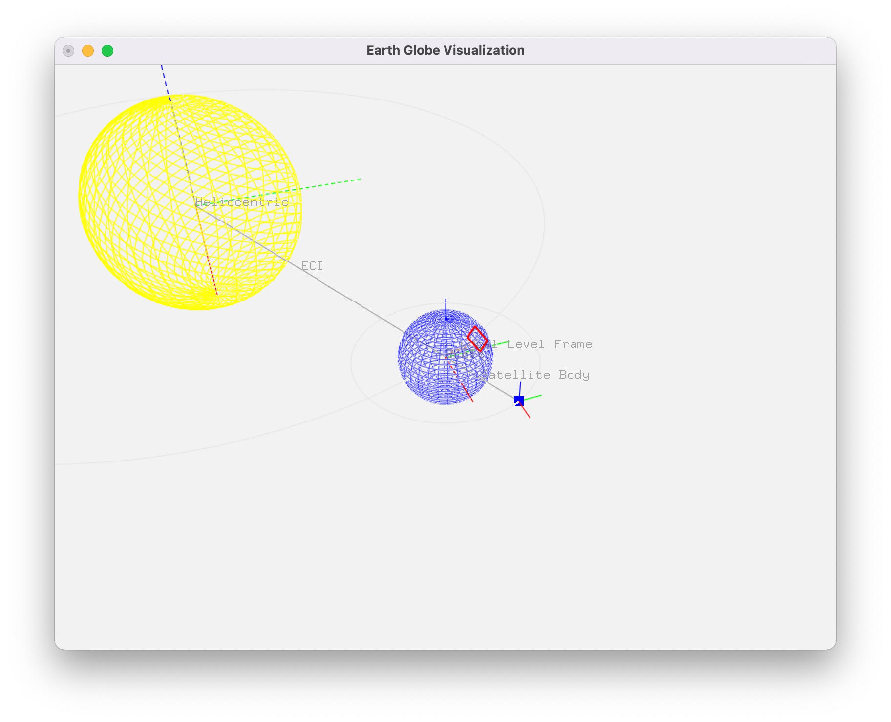

# 3D Globe Visualization

A Python-based OpenGL visualization tool that demonstrates various reference frames and orbital mechanics, including Earth's rotation, satellite orbits, and coordinate transformations.



## Features

- Multiple reference frame visualizations:
  - Heliocentric frame
  - Earth-Centered Inertial (ECI) frame
  - Earth-Centered Earth-Fixed (ECEF) frame
  - Orbital frame
  - Local Level Frame (LLF)
- Interactive 3D camera controls
- Satellite orbit visualization
- Coordinate axes for each reference frame
- Earth rotation and orbital motion around the Sun
- Pause/resume simulation capability

## Requirements

- Python 3.x
- NumPy
- PyOpenGL
- SciPy

Install dependencies using:

```bash
pip install numpy pyopengl scipy
```

## Usage

Run the visualization:

```bash
python core.py
```


### Controls

- **Mouse**: 
  - Left-click and drag to orbit the camera
  - Scroll wheel to zoom in/out
  
- **Keyboard**:
  - `f`: Toggle between ECI and ECEF reference frames
  - `t`: Cycle camera target (Earth → Satellite → Sun → Earth)
  - `i`: Zoom in
  - `o`: Zoom out
  - `Space`: Pause/resume simulation
  - `ESC`: Exit application

## Reference Frames

- **Heliocentric Frame**: Sun-centered reference frame
- **ECI (Earth Centered Inertial)**: Fixed with respect to the stars, centered on Earth
- **ECEF (Earth Centered Earth Fixed)**: Rotates with the Earth
- **Orbital Frame**: Reference frame for satellite orbit
- **Local Level Frame**: Tangent plane at specified latitude/longitude

## Visualization Elements

- Yellow wireframe: Sun
- Blue wireframe sphere: Earth
- Blue dot: Satellite
- Grey circle: Orbital path
- Colored axes:
  - Red: X-axis
  - Green: Y-axis
  - Blue: Z-axis
  - Dashed lines: Inertial frame axes
  - Solid lines: Non-inertial frame axes

## Project Structure

- `core.py`: Main implementation file containing:
  - Reference frame hierarchy
  - 3D object implementations
  - OpenGL visualization setup
  - User interaction handling